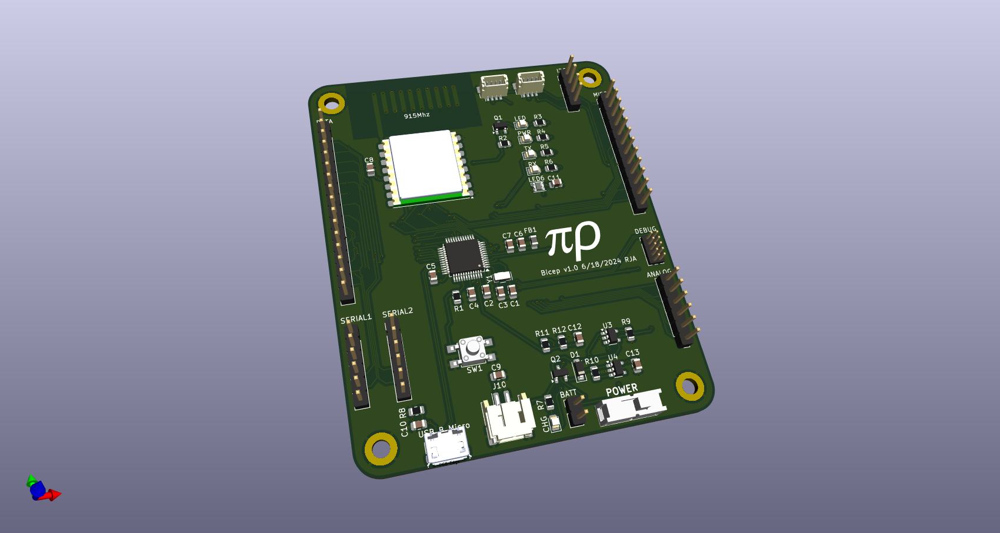
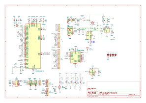

# Bicep - Flexing my "ARM" muscles

This is a simple ARM Cortex M0 development board with:
* SAMD21 cpu
* 2 serial connectors
* 915MHz Hope RFM95 Lora module
* LiPo battery w/usb charger and on-off switch
* 3 I2C connectors (2 QWIIC and one pin header)

[Schematic pdf](v1.0.bicep.pdf)

